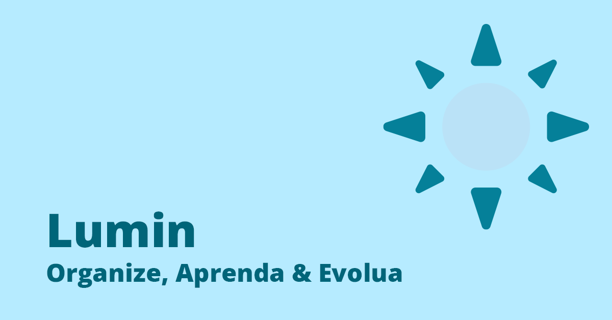

## 📚 Informações do Projeto

**Nome do Projeto:** Lumin - Plataforma de Organização de Estudos

**ETEC:** ETEC Lauro Gomes

**Turma:** 1ª Série | Turma E | Desenvolvimento de sistemas

**Monitor:** Elmo Ficagna

**Articuladore Iochpe**: Fernanda Santos

**Integrantes da Equipe:**

- Arthur Pereira Faria
- Heikon Silva Costa
- Jhonatan Oliveira Aranha

## 🎯 Descrição do Projeto

### Problema Identificado

As pessoas enfrentam dificuldades para organizar suas atividades acadêmicas, gerenciar prazos e manter um cronograma de estudos eficiente. A falta de uma ferramenta centralizada que combine organização de tarefas, calendário e recursos de IA resulta em baixa produtividade e estresse.

### Solução Proposta

Lumin é uma plataforma web moderna que oferece:

- **🗂️ Kanban Board**: Sistema visual para organização de tarefas de estudo
- **📅 Calendário Integrado**: Gestão de prazos e cronogramas
- **🤖 Assistente IA**: Sugestões inteligentes para otimização dos estudos
- **👤 Sistema de Autenticação**: Dados seguros e personalizados por usuário
- **📊 Acompanhamento de Progresso**: Métricas de evolução nos estudos

<!-- ### ✅ Implementadas

- Autenticação de usuários (Supabase Auth)
- Kanban de tarefas com realtime (criar/listar/mover) e drag & drop
- Modo escuro/claro

### 🔄 Em Desenvolvimento

- Calendário de estudos
- Assistente IA (sugestões e ações operacionais)
- Edição e exclusão de tarefas (CRUD completo)
- Sistema de notificações
- Relatórios de produtividade
- Integração com APIs externas
- Sistema de gamificação -->

## 🛠️ Tecnologias Utilizadas

O projeto foi desenvolvido com base em tecnologias modernas e amplamente utilizadas no mercado, garantindo eficiência, escalabilidade e manutenibilidade.

- **Frontend**: [HTML](developer.mozilla.org/pt-BR/docs/Web/HTML), [CSS (Tailwind CSS)](https://tailwindcss.com/), [JavaScript (ES6+)](https://developer.mozilla.org/pt-BR/docs/Web/JavaScript)
- **Serviços**: [Supabase (Auth, Postgres, Realtime)](https://supabase.com/), [Google AI Studio](https://aistudio.google.com/)
- **Bibliotecas**: [FullCalendar.js](https://fullcalendar.io/), [Email.js](https://www.emailjs.com/)
- **Ferramentas**: [Git](https://git-scm.com/), [VS Code (desenvolvimento)](https://code.visualstudio.com/), [SVG Artista (Animações SVG)](https://svgartista.net/), [Vite](https://vite.dev/)

> O uso de ferramentas amplamente adotadas por empresas como Netflix, Reddit, GoDaddy e Google reforça a robustez técnica da solução.

## 🎥 Vídeo de Apresentação

Assista ao vídeo de apresentação do projeto no YouTube:

https://youtu.be/P1Pe2AT4d30?si=3fG_6lku2y6h-07i

## 📋 Pré-requisitos para setup local

- Navegador web moderno (Chrome, Firefox, Safari, Edge)
- Rapida conexão com internet
- Editor de código
- Git instalado

## 🌐 Deploy

O projeto está configurado para deploy no GitHub Pages:

- **URL de Produção**: `https://heikonsilva.github.io/lumin-venturus/`
- **Branch de Deploy**: `main`

## 🧭 Setup e Documentação

Para configurar e rodar o projeto localmente, consulte os guias abaixo:

- Guia de setup local: [docs/setup.md](./docs/setup.md)
- Configuração do Supabase: [docs/supabase.md](./docs/supabase.md)
- Autenticação anônima (Convidado): [docs/anonymus-signin.md](./docs/anonymus-signin.md)
- Configuração do Firebase (Gemini AI): [docs/firebase.md](./docs/firebase.md)
- Login com Google (OAuth): [docs/google-oauth.md](./docs/google-oauth.md)

## � Contribuição

Para contribuir com o projeto:

1. Faça um fork do repositório
2. Crie uma branch para sua feature (`git checkout -b feature/nova-funcionalidade`)
3. Commit suas mudanças (`git commit -m 'Adiciona nova funcionalidade'`)
4. Push para a branch (`git push origin feature/nova-funcionalidade`)
5. Abra um Pull Request

## 📄 Licença

Este projeto foi desenvolvido para fins acadêmicos como parte do programa Lumin da ETEC Lauro Gomes.

## 📞 Contato

Para dúvidas ou sugestões, entre em contato com a equipe através dos commits do GitHub ou issues do repositório.

---

**Lumin** - _Organize, Aprenda & Evolua_ 💡
