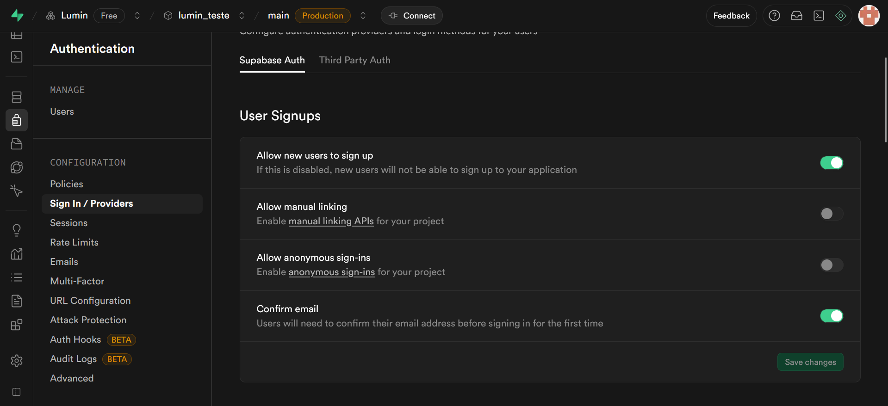

# Autenticação anônima (Convidado)

A autenticação como convidado permite que o usuário acesse o Lumin sem criar uma conta nem fazer login com o Google.
A única desvantagem desse método é que não é possível fazer login novamente na mesma conta convidada posteriormente.

Para este passo, é necessário já ter feito a [configuração do Supabase](./supabase.md).

## Como habilitar

1. No Supabase, acesse: Authentication > Sign in / Providers
2. Marque a opção "Allow anonymous sign-ins"

