# Configuração do Firebase

O Firebase no Lumin é utilizado para a funcionalidade de IA por meio de uma integração com o Gemini AI da Google.

## 1. Criar o projeto

Entre no site [Firebase Console](https://console.firebase.google.com/u/0/)

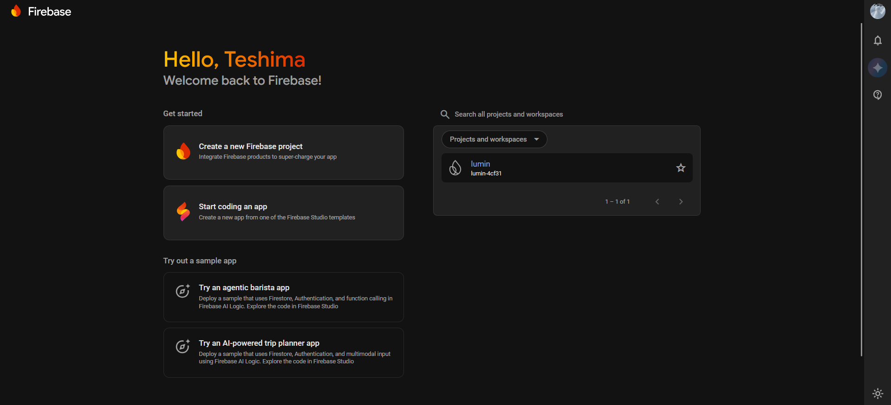

Crie um projeto.

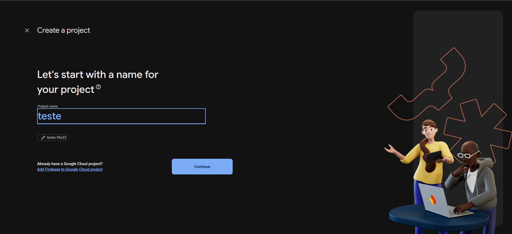

Habilite a Assistência de IA (opcional).

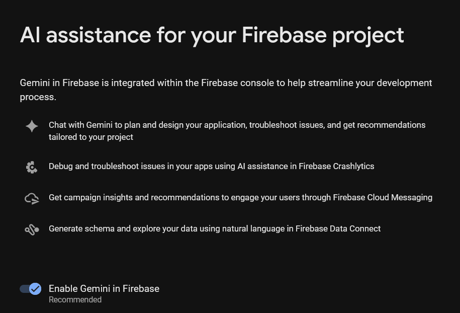

Habilite o Google Analytics (opcional).

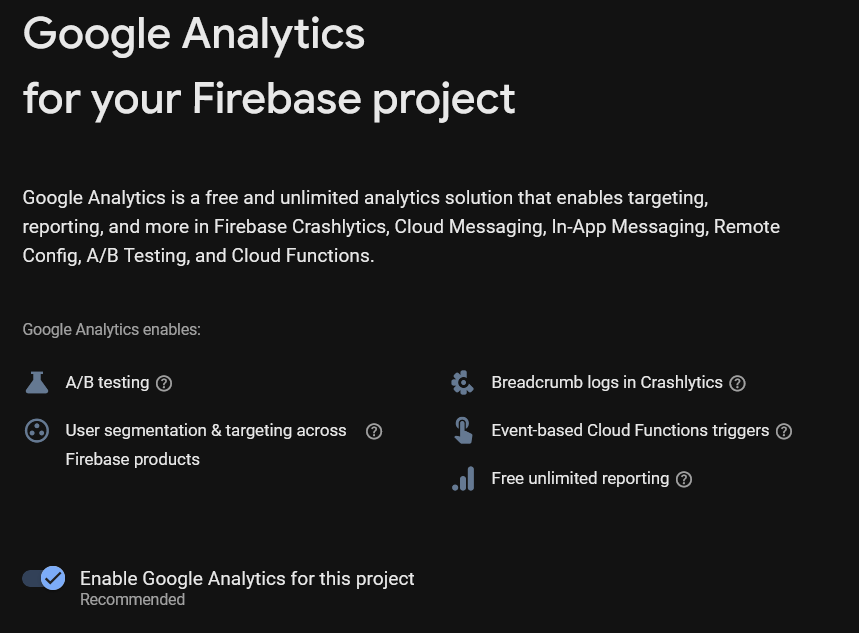

Se ativou o Google Analytics, defina a conta.

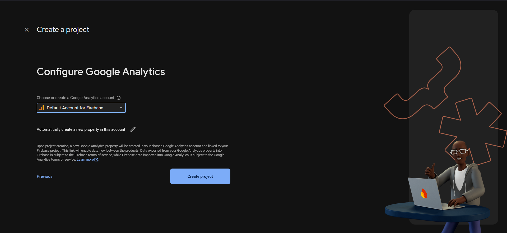

Concluída a criação, seu projeto estará pronto.

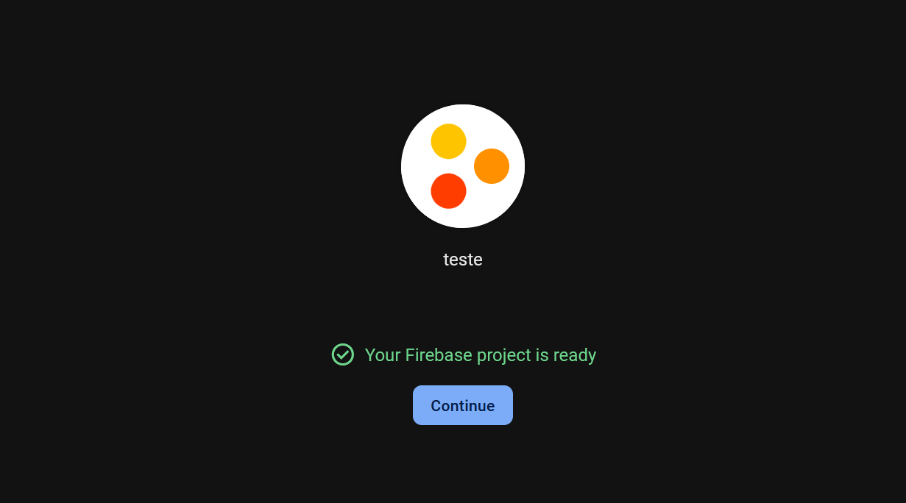

Ao criar o projeto, você deve ser redirecionado para este dashboard:

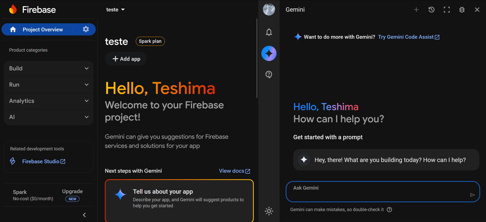

## 2. Ativar Gemini (AI) no Firebase

Na barra lateral, entre em AI > AI Logic e clique em "Get started".

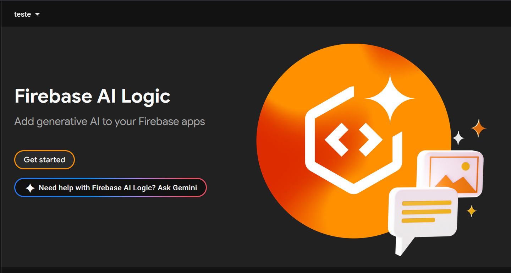

Uma janela de escolha aparecerá. Selecione o modelo de IA:

- Gemini Developer API: sem custo.
- Vertex AI Gemini API: voltado a serviços corporativos de grande escala.

Para este projeto, escolha Gemini Developer API.

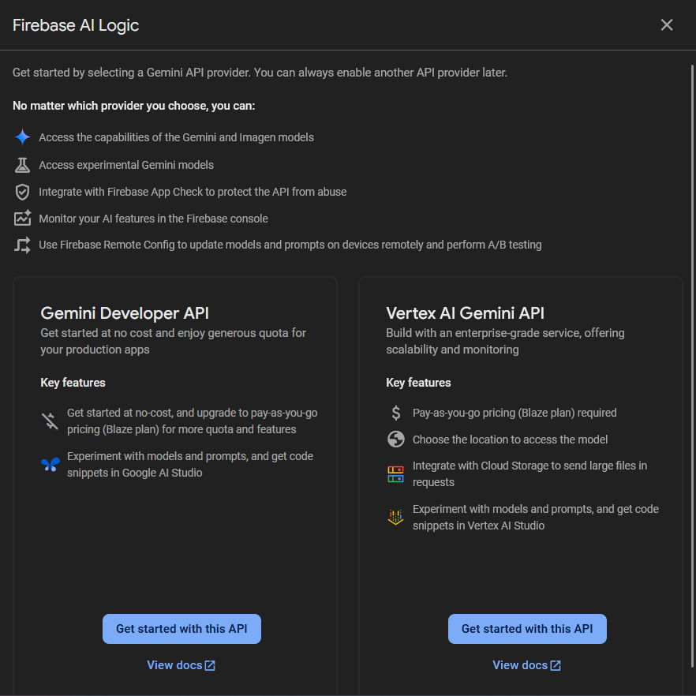

Após clicar em "Get started", começará o processo de habilitação da IA. Prossiga com "Enable".

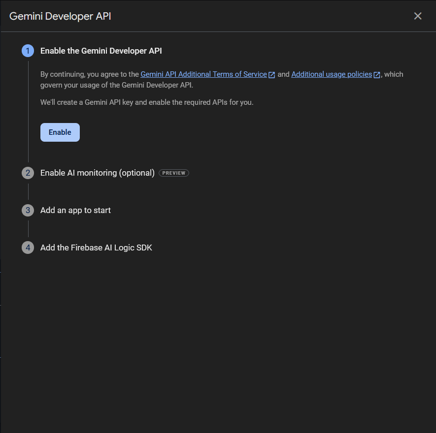

O monitoramento da IA habilita telemetria de uso (opcional).

## 3. Registrar um app Web

Agora que a IA está ativada, crie um aplicativo do tipo Web no Firebase.

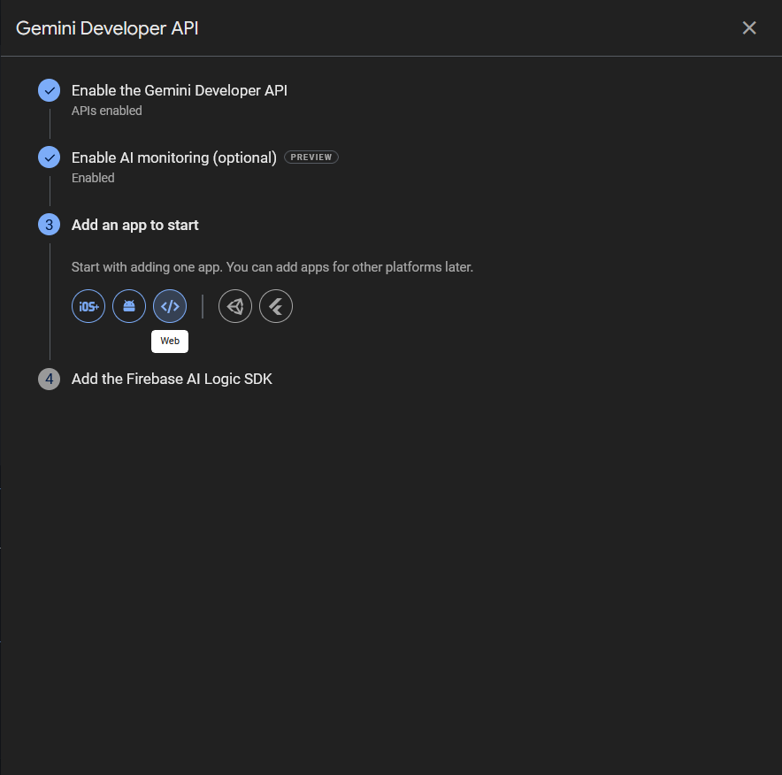

Defina um nome. A caixa "Also set up Firebase Hosting for this app" não é necessária. Continue.

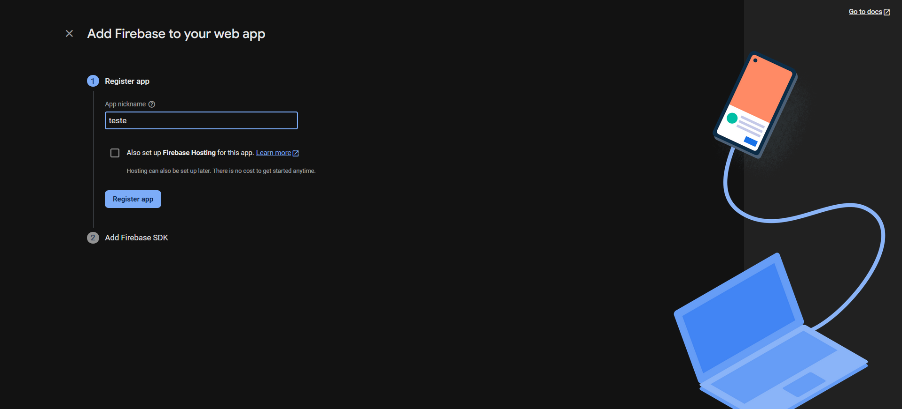

O Firebase exibirá o código necessário para usar o app que você criou. Copie o trecho destacado.

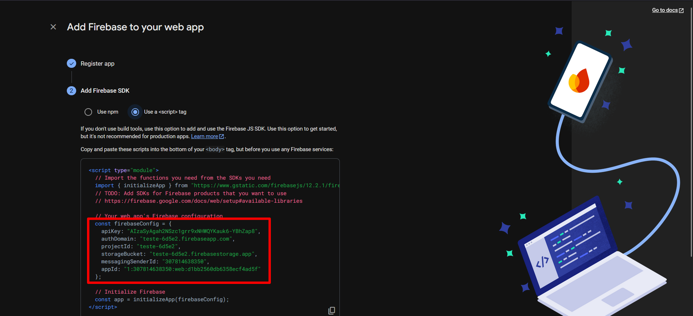

Abra o arquivo `services/firebase.js` no seu editor e substitua o objeto de configuração (o trecho destacado em vermelho) pelo snippet copiado anteriormente.

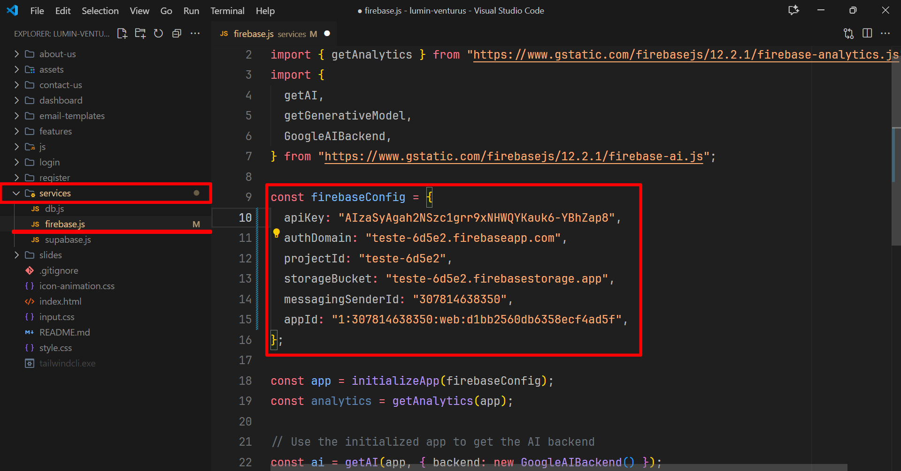

Pronto, o Firebase está configurado para uso.

## Leia também

- [Configuração do Supabase](./supabase.md)
- [Hospedagem local do projeto](./setup.md)
