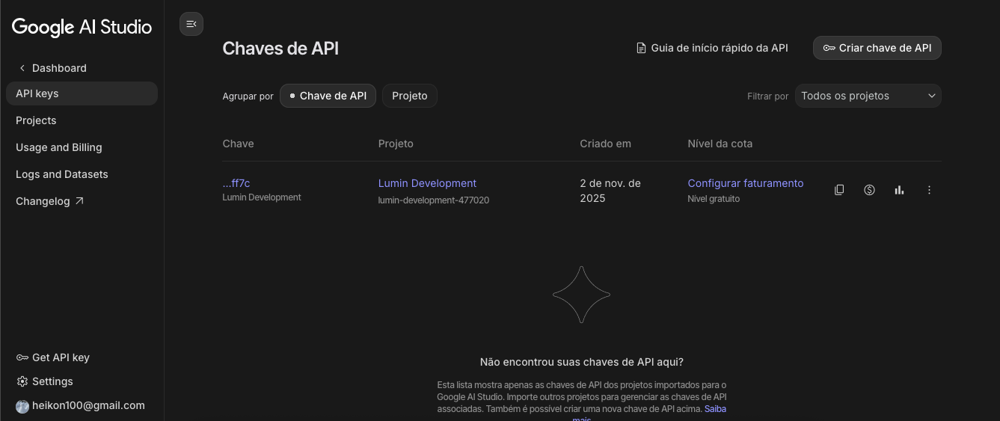
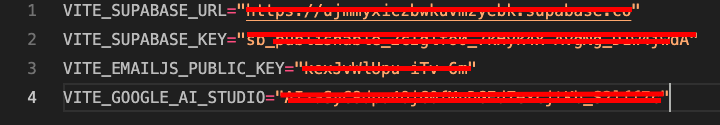

# Google AI Studio

O Google AI Studio é a plataforma que permite que nós possamos fazer o uso do modelo do gemini para nossas aplicação.

Para poder utilizar o modelo, é necessário antes gerar uma chave de api.

O primeiro passo é entrar no site do [AI Studio](https://aistudio.google.com/api-keys) com sua conta do google. Se você não consegue entrar, [certifique-se de que está em um país suportado](https://ai.google.dev/gemini-api/docs/available-regions?hl=pt-br) e que tenha a sua idade verificada em sua conta.

Se tudo ocorreu como esperado, você deve se deparar em um painel parecido com este

Para criar uma chave, clique no botão rotulado "Criar chave de API". Um formulário deve abrir contendo nome e um projeto para importar.

Para ter um projeto você pode seguir o guia de [Autenticação OAuth Google](google-oauth.md) e após feito você deve poder selecionar o projeto na importação.

Com tudo certo o seu projeto irá aparecer na lista, a coluna de chave é a primeira, pode clicar no rótulo do item referente ao projeto importado e então você terá a sua chave.

Para configurar o projeto com a chave basta criar um arquivo `.env.development` na pasta do projeto e definir a chave `VITE_GOOGLE_AI_STUDIO` como mostra a foto a seguir.

