# Autenticação com Google (OAuth)

A autenticação com o Google funciona por meio de OAuth.

Para este passo, é necessário já ter feito a [configuração do Supabase](./supabase.md).

## 1. Criar projeto no Google Cloud

Entre no [Google Cloud Console](https://console.cloud.google.com).

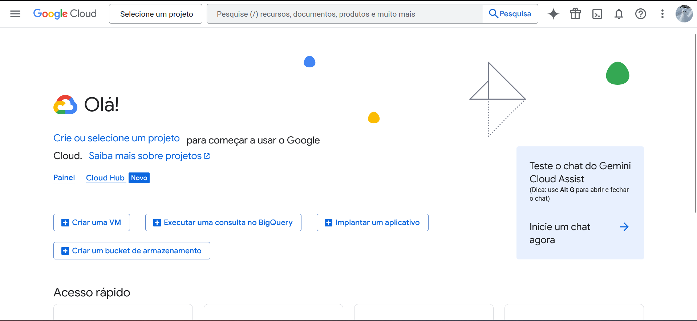

Crie um projeto e defina o nome.

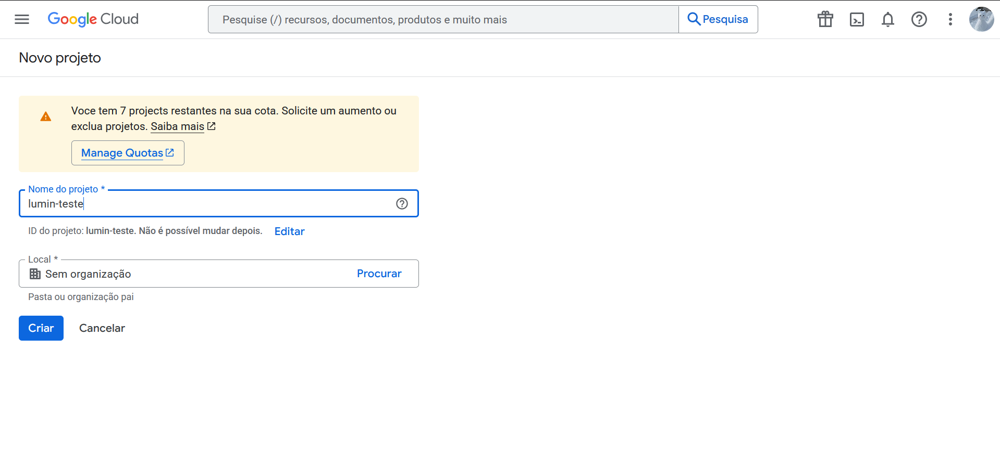

Após a criação, você será redirecionado ao Google Cloud. Selecione o projeto criado.

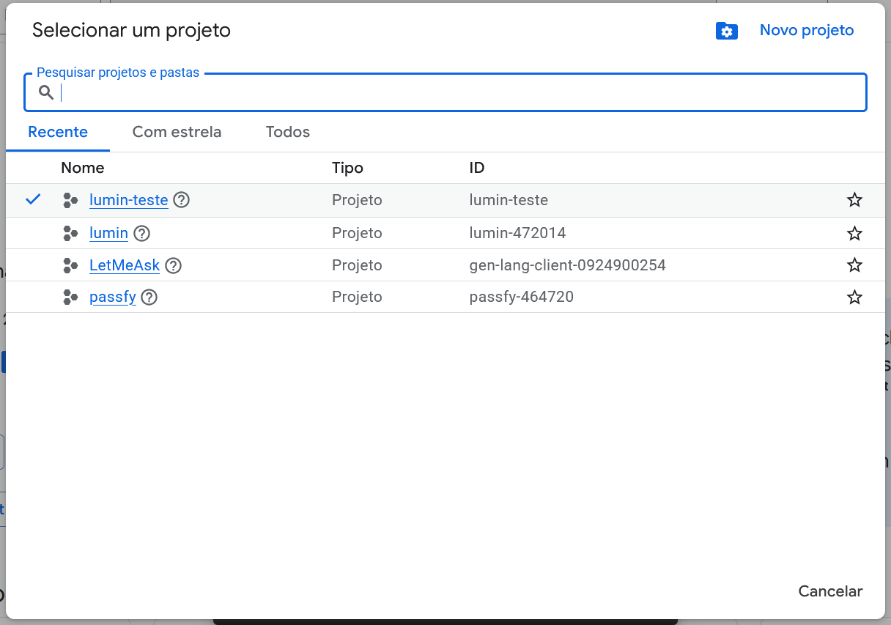

## 2. Configurar Tela de Permissão OAuth

Na barra lateral, em "APIs e Serviços", acesse "Tela de permissão OAuth".

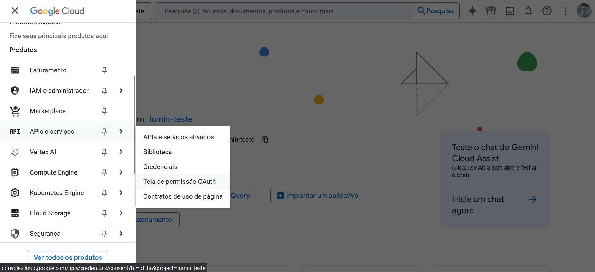

Você deve ver a visão geral. Vamos criar um cliente OAuth; comece por aqui.

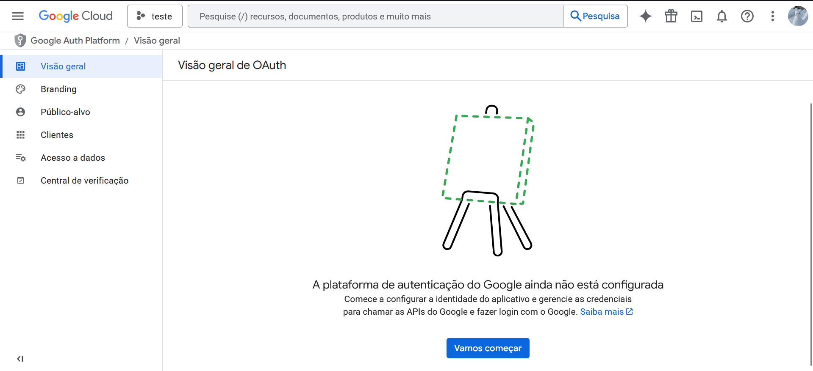

Preencha os dados e crie a configuração de autenticação do projeto. Para uso público, prefira a opção "Externo", permitindo login com Google por qualquer usuário.

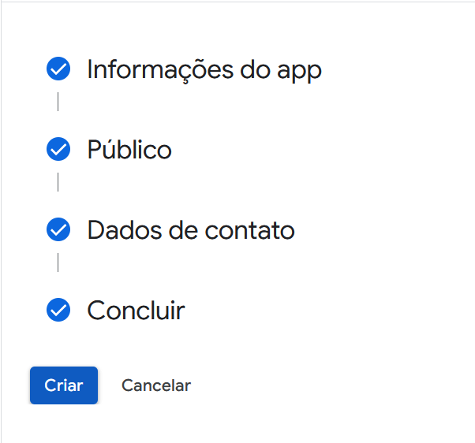

## 3. Criar um OAuth Client

Crie um Cliente OAuth.

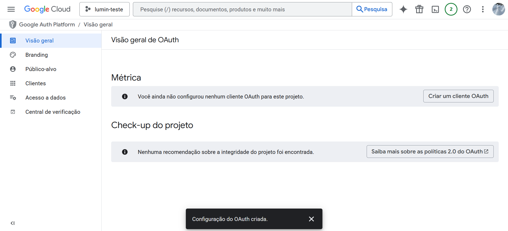

Defina o tipo como "Aplicativo da Web" e dê um nome.

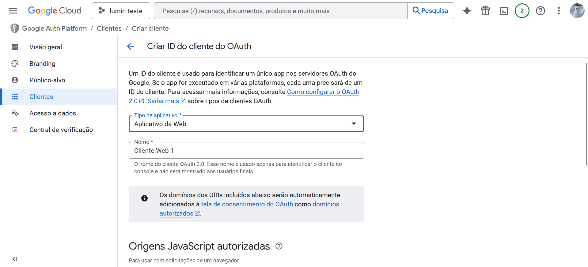

Mais abaixo, em "Origens JavaScript autorizadas", insira o endereço de hospedagem do frontend.

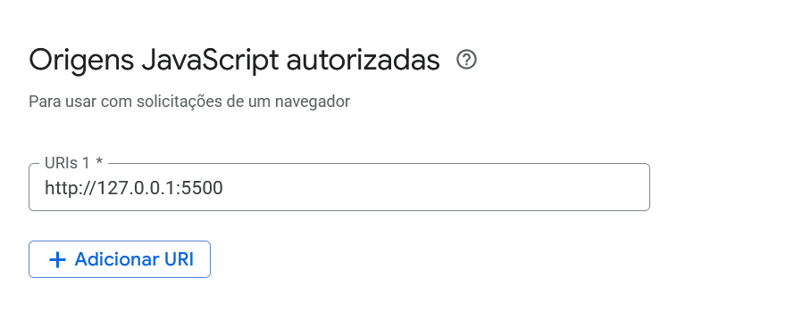

Em "URIs de redirecionamento autorizados", utilize a URL de callback disponível no [Supabase](https://supabase.com/dashboard) em Authentication > Sign in / Providers > Google.

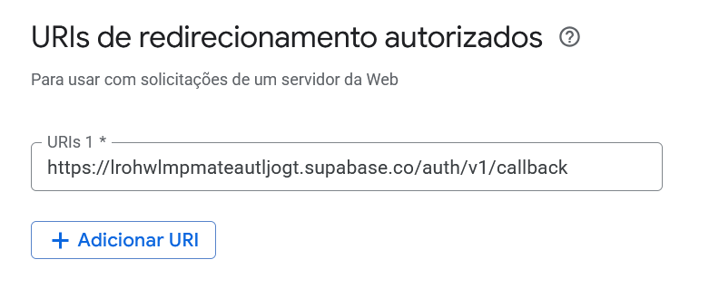

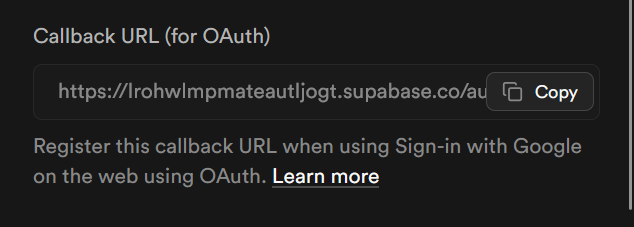

Após a criação, um popup exibirá o Client ID e o Client Secret.

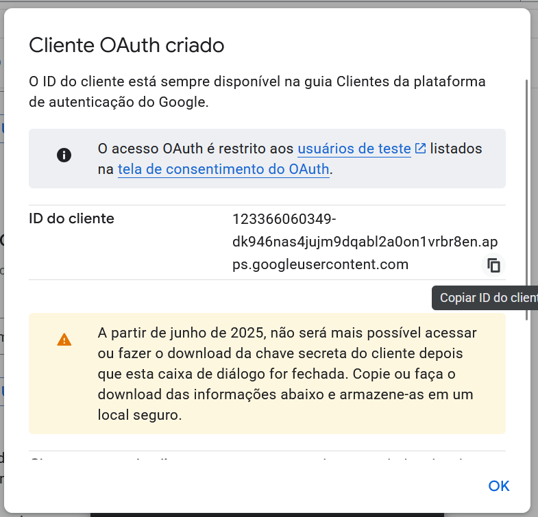
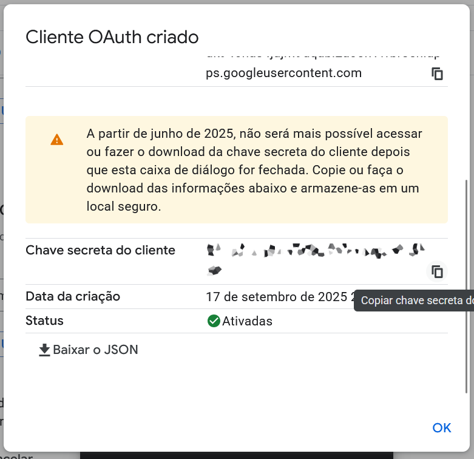

Agora insira esses dados nos campos correspondentes no Supabase e marque a opção "Enable Sign in with Google".

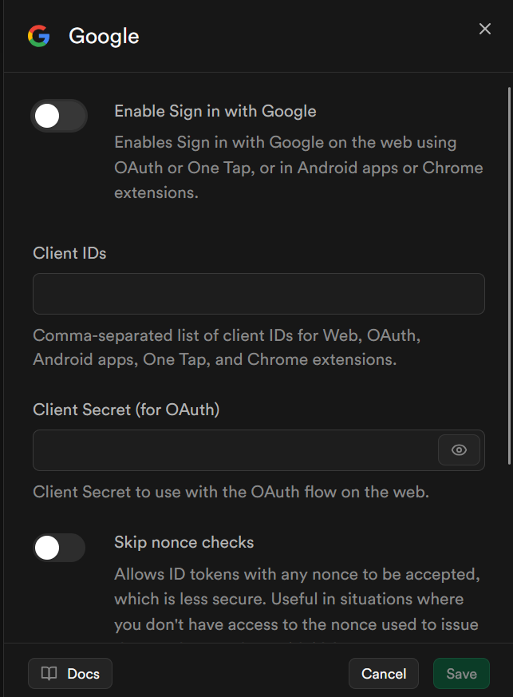

## Aviso

A autenticação com Google pode demorar alguns minutos para funcionar após a configuração inicial.
