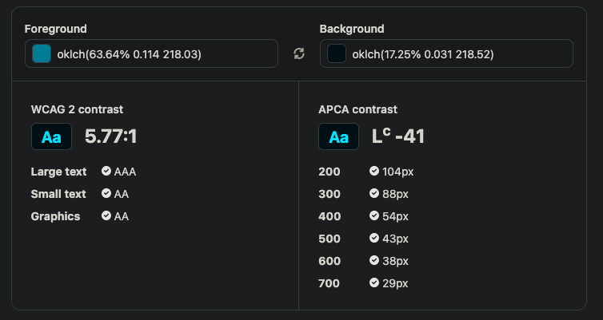

# Progresso da Mentoria

## Sessão 1

### Checklist de Ajustes

- [x] Múltiplos H1 na mesma página [Commit 075dd71](https://github.com/HeikonSilva/lumin-venturus/commit/075dd714ab0d2d3b71dff05c2124c11ab9d50741#diff-47f81b054e17a145dfabce1f93df69ae938f94191cb1cd51a352d6cae4413b98L132)
  - Consolidado um único H1 por página para manter a hierarquia semântica.
- [x] Uso de `a` onde deveria ser `button` [Commit 075dd71](https://github.com/HeikonSilva/lumin-venturus/commit/075dd714ab0d2d3b71dff05c2124c11ab9d50741#diff-b1bf67f800adcf641c8a36ec41df6b04cbc37aa43818ce0fbe29537658ddf629L145)
  - Links convertidos para botões quando a ação não envolve navegação.
- [x] Uso inconsistente de ARIA Landmarks (ex.: modais) [Commit 075dd71](https://github.com/HeikonSilva/lumin-venturus/commit/075dd714ab0d2d3b71dff05c2124c11ab9d50741#diff-1a771c75d757e61f6303de69d515c0cb25eb45ea56b21ceaba4cb8247b1d3b3eL202)
  - Revisto o markup dos modais para expor landmarks apropriadas.
- [x] Uso inconsistente de ARIA Landmarks (ex.: falta de ARIA em botões de ação) [Commit d54db55](https://github.com/HeikonSilva/lumin-venturus/commit/d54db55b60206aa2f4ec8c27a0851148ecf41873) e [Commit 6f4aebe](https://github.com/HeikonSilva/lumin-venturus/commit/6f4aebe94ddc55844b00bc3220f40aa6ea49526a)
  - Adicionados `aria-label` e atributos de controle nos botões com ícones.
- [?] WCAG AA (contraste de cor com o background)
  - Há divergência entre a medição do monitor do projeto (3.2:1) e a checagem feita via https://atmos.style/contrast-checker (5.77:1); aguarda validação final.

### Evidências de Contraste

> 
>
> A checagem via [atmos.style](atmos.style/contrast-checker) retornou contraste 5.77:1, enquanto o monitor registrou 3.2:1. A conclusão definitiva depende de reconciliar as leituras e confirmar a configuração de ambos os testes.

### Outras Melhorias

- [x] Inconsistência de design nas páginas de autenticação [Commit 2dc8257](https://github.com/HeikonSilva/lumin-venturus/commit/2dc82579be7be16f1b8233263132996c5b2bda9d) e [Commit 59a601e](https://github.com/HeikonSilva/lumin-venturus/commit/59a601e40e8d1b5ff70329613ba22595ade22eeb)
  - Layouts de login/register alinhados ao design-system.
- [x] Pequenas correções em relação aos estilos para os temas dark/light [Commit 9825a59](https://github.com/HeikonSilva/lumin-venturus/commit/9825a59b047c54780e787f8d006fc8e22a562e29)
  - Ajustes finos nos tokens para garantir paridade entre temas.

---

## Sessão 2

### Checklist de Ajustes

- [ ] Reorganizar as dependências do projeto.
  - O `@tailwindcss/cli` é uma dependência de desenvolvimento e não será incluída no bundle final.
- [ ] Adicionar biblioteca para servir os arquivos do site
  - Remover a dependência externa da extensão Live Server.
- [ ] Visualização dos outros meses no calendário
  - Limitação relevante atualmente tratada como bug.
- [ ] Notificação de "Fora do Prazo" para tarefas
  - Definir comportamento e canais de alerta.
- [ ] Atualização da documentação do projeto

### Evidências e Discussões

- Mentor confirmou que o contraste da paleta está dentro do recomendado; a leitura incorreta vinha da extensão, que apresentou imprecisão na conversão do padrão OKLCH para HEX.
- É permitido construir uma API própria em Node e integrar um banco de dados. A nota final considera apenas a integração com esses serviços; Docker também é aceito. As diretrizes seguem abertas por conta da abrangência da categoria.

### Observações Gerais

- Avaliar a migração para Vite (vanilla, MPA) garantindo compatibilidade com a estrutura atual antes da adoção definitiva.
- Considerar ferramentas adicionais de linting para complementar a formatação hoje feita com Prettier.

---

## Sessão 3

### Checklist de Ajustes

### Evidências e Discussões

### Observações Gerais

---

## Sessão 4 (Final)

### Checklist de Ajustes

### Evidências e Discussões

### Observações Gerais
