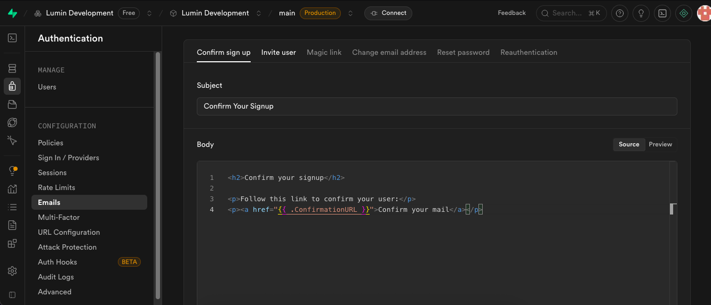

Entre no seu projeto pelo dashboard do supabase então vá até a aba de autenticação > emails

Aqui você pode customizar os emails mandados para os usuários.

Já fizemos dois templates pre-feitos: [Cadastro](./email-templates/confirm-signup.html) e [Redefinir Senha](./email-templates/reset-password.html)
