# Configuração do Supabase

O Supabase é utilizado para persistir os dados da aplicação (Postgres) e para lidar com o sistema de autenticação.

Esta é a dashboard ao entrar com uma conta no [Supabase](https://supabase.com/dashboard/sign-in):

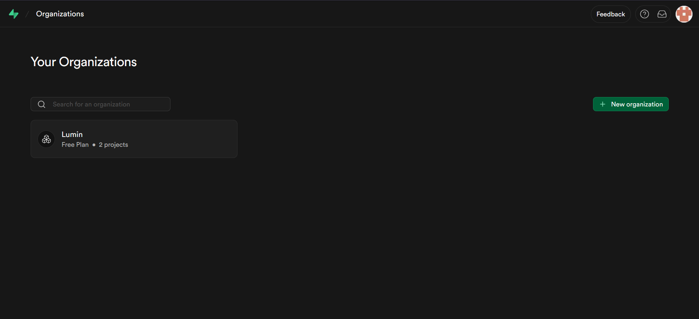

## 1. Criar organização e projeto

Primeiro, crie uma organização:

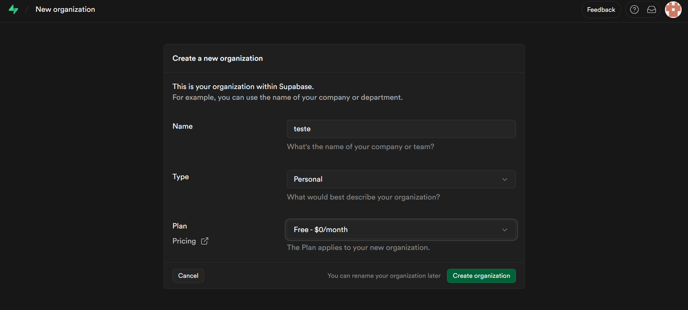

Depois, crie um projeto. Defina o nome, gere uma senha de banco de dados e guarde essa senha com segurança. A região pode ser definida de acordo com a sua localidade.

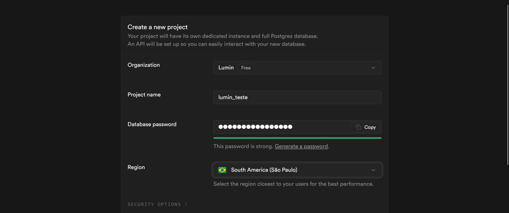

Após a criação, você deve ver esta tela:

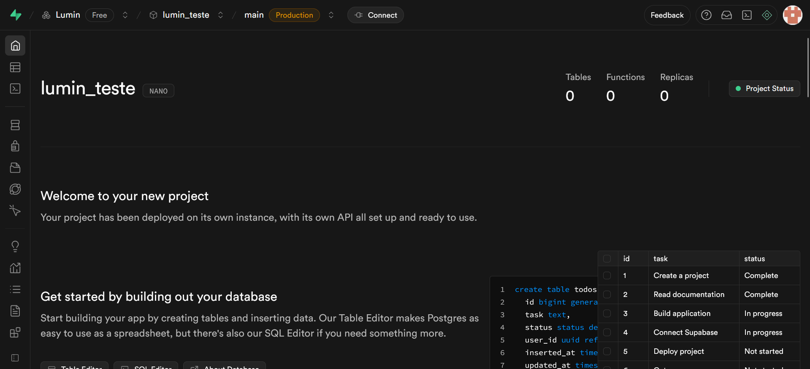

## 2. Criar as tabelas

Na barra lateral, entre em "SQL Editor".

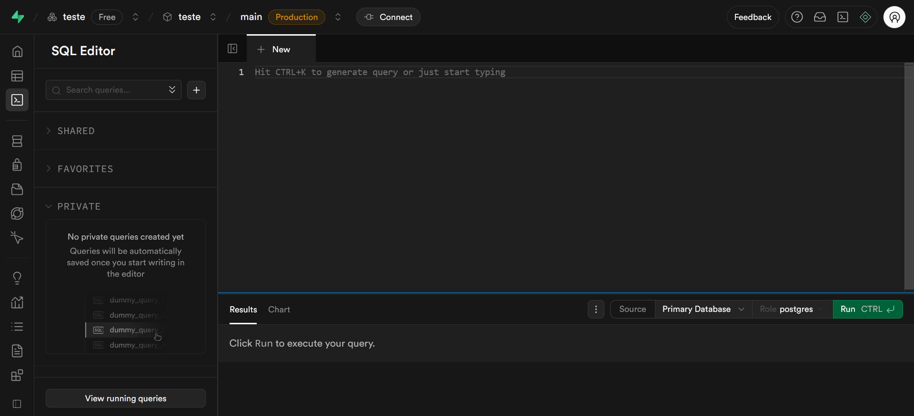

No editor, insira o script abaixo e clique em "Run" para criar as tabelas:

```
CREATE TABLE public.ai_chats (
  id uuid NOT NULL DEFAULT gen_random_uuid(),
  user_id uuid NOT NULL,
  title text,
  created_at timestamp with time zone NOT NULL DEFAULT now(),
  updated_at timestamp with time zone NOT NULL DEFAULT now(),
  CONSTRAINT ai_chats_pkey PRIMARY KEY (id)
);
CREATE TABLE public.ai_messages (
  id uuid NOT NULL DEFAULT gen_random_uuid(),
  chat_id uuid NOT NULL,
  role text NOT NULL CHECK (role = ANY (ARRAY['user'::text, 'assistant'::text])),
  content text NOT NULL,
  parsed_json jsonb,
  created_at timestamp with time zone NOT NULL DEFAULT now(),
  CONSTRAINT ai_messages_pkey PRIMARY KEY (id),
  CONSTRAINT ai_messages_chat_id_fkey FOREIGN KEY (chat_id) REFERENCES public.ai_chats(id)
);
CREATE TABLE public.tasks (
  id uuid NOT NULL DEFAULT gen_random_uuid(),
  user_id uuid NOT NULL DEFAULT gen_random_uuid(),
  status text NOT NULL DEFAULT ''::text,
  priority text NOT NULL DEFAULT ''::text,
  type text NOT NULL,
  name text NOT NULL,
  description text,
  start_date timestamp with time zone,
  end_date timestamp with time zone,
  created_at timestamp with time zone DEFAULT now(),
  CONSTRAINT tasks_pkey PRIMARY KEY (id)
);
```

## 3. Obter credenciais do projeto

Vamos pegar duas informações: a URL do projeto e a chave de API.

Em Project Settings > Data API, copie a Project URL.

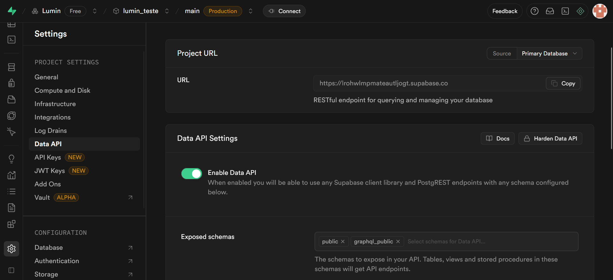

Em Project Settings > API Keys (aba "API Keys"), crie uma chave em "Create new API Keys" e copie a Publishable Key.

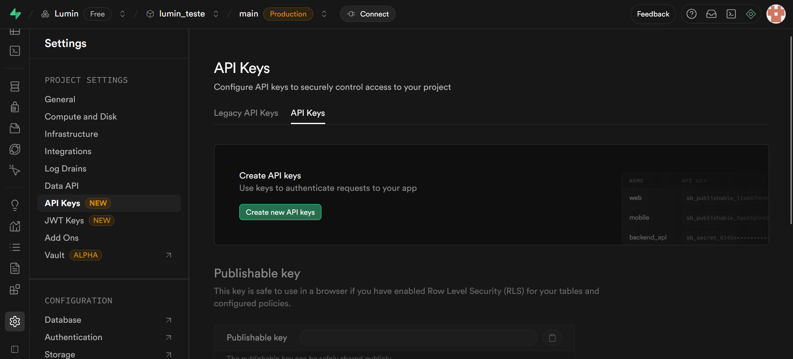

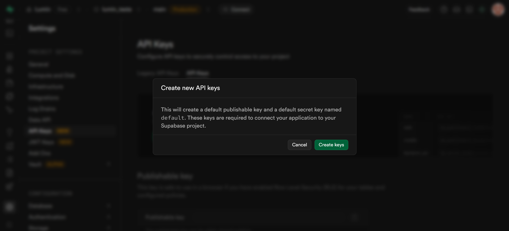

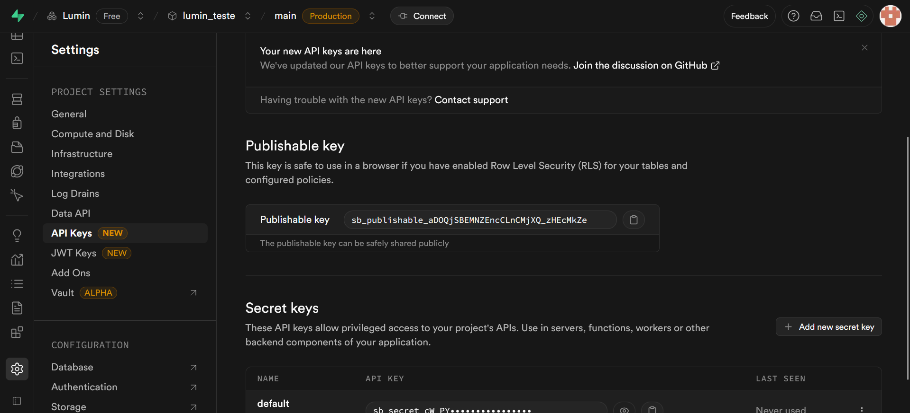

Crie o arquivo `.env.development.local` dentro da pasta do projeto, e no seu editor e insira a Project URL e a Publishable Key nos campos correspondentes.

```env
VITE_SUPABASE_URL="sua url do projeto"
VITE_SUPABASE_KEY="sua chave de api"
```

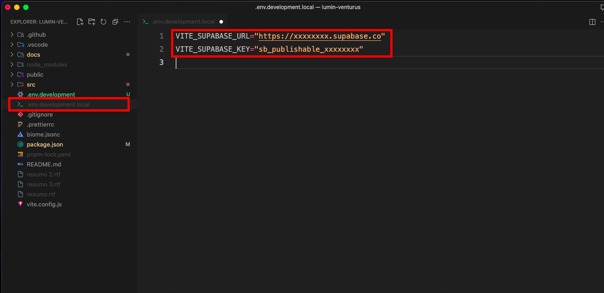

## 4. Configurar autenticação

Para habilitar a autenticação como convidado, vá em Authentication > URL Configuration.

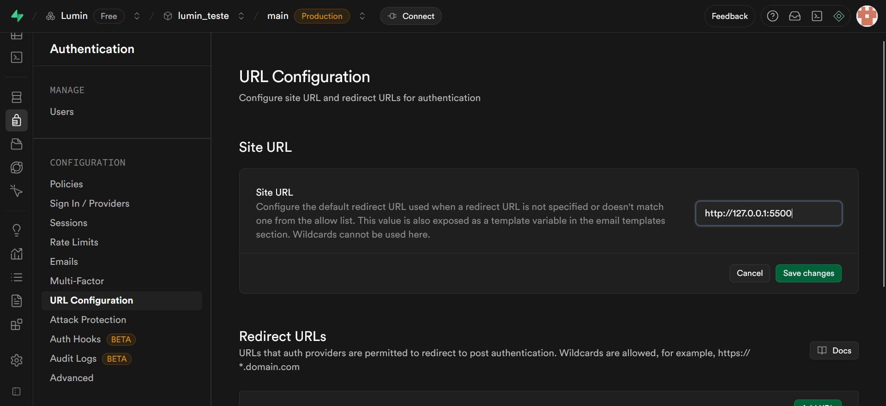

No campo "Site URL", escreva o endereço onde você está hospedando o projeto (por exemplo, `http://localhost:5173`).

Depois, em Authentication > Providers, habilite "Allow anonymous sign-ins" e os provedores desejados (Email, Google, etc.).

Agora a autenticação por e-mail está configurada.

## Leia também

- [Configuração da autenticação com Google](./google-oauth.md)
- [Configuração da autenticação como convidado](./anonymus-signin.md)
